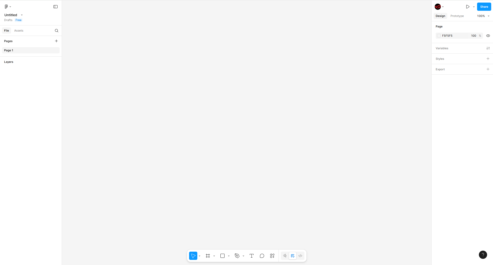
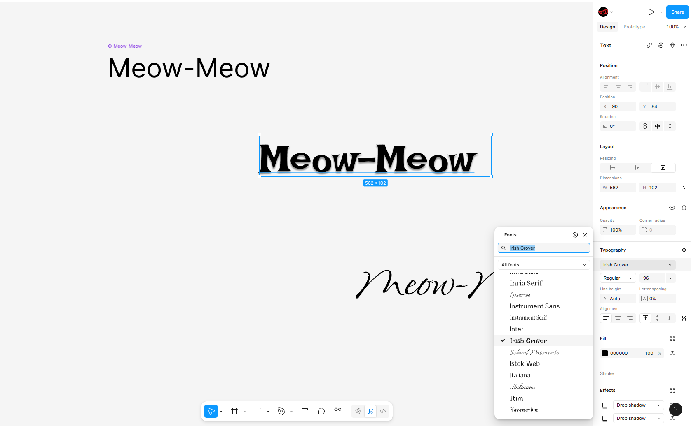

# Как настраивать шрифты в Figma

Для того, чтобы настроить шрифт в Фигма, нужно создать новый файл и используем инструментарий внизу для ввода текста или копируем его.

Дальнейшие настройки и изменения мы делаем через инструментарий справа. К примеру, можно выбрать шрифт для текста.

* Выбираем любой текстовый объект на холсте.

* В правой панели откройте вкладку Text → Typography.

* В выпадающем списке выберите нужный шрифт.

* Не все шрифты отображаются на русско- и украино-язычном тексте, т.к. были в основном созданы для латиницы.

После выбора шрифта можно настроить:

* Размер (Font Size) — высота символов.

* Начертание (Weight) — толщина (Light, Regular, Bold и т. д.).

* Межстрочный интервал (Line Height) — расстояние между строками.

* Межбуквенное расстояние (Letter Spacing) — расстояние между символами.

* Выравнивание (Alignment) — по левому, правому краю, по центру и т. д.