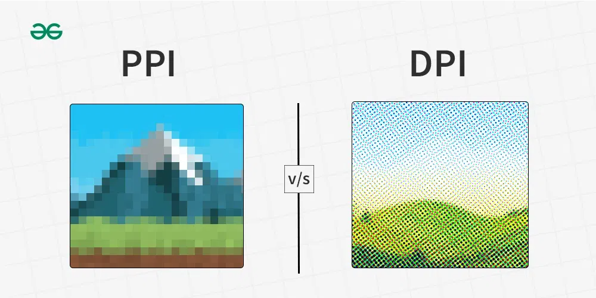
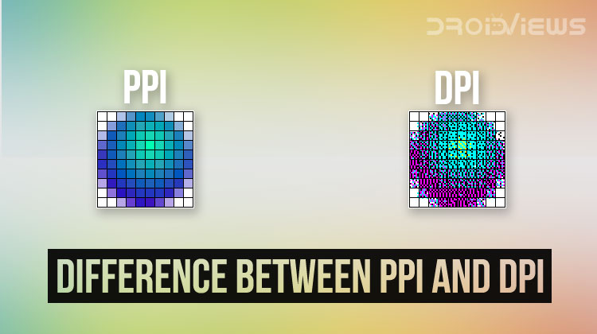
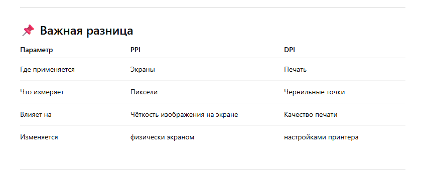
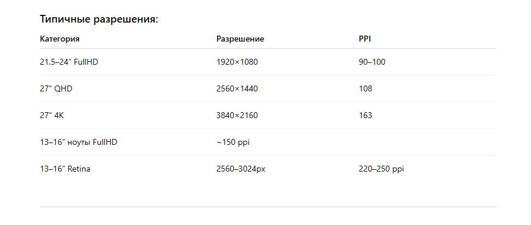

# 1. Базовые понятия

### Разрешение (Resolution)

Это количество пикселей по горизонтали и вертикали.
Например: 1920×1080, 1080×2400, 2560×1440.

* Чем больше пикселей — тем «чётче» изображение.

* Важно - надо учитывать физический размер устройства.

### Диагональ (Screen size)

Физический размер экрана в дюймах: 6.5", 10.5", 27" и т.д.
Два устройства могут иметь одинаковое разрешение, но разную плотность пикселей.

### Плотность пикселей (PPI / DPI)

PPI — pixels per inch — сколько пикселей помещается на 1 дюйме.

Пример:

* Телефон 6.5” с разрешением 1080×2400 → ~390 PPI

* Монитор 24” с 1080p → ~92 PPI

**_**Чем выше PPI — тем более "гладкая" картинка.**_**

### DPI = точек на дюйм

Это характеристика печати.

Она показывает плотность чернильных точек, которые ставит принтер на бумаге.

#### _**Чем выше DPI, тем детальнее и качественнее будет распечатка.**_

Где используется:

* принтеры

* сканеры

* графические планшеты (иногда)

Примеры:

* 300 DPI — стандартная качественная печать

* 600 DPI — высокая детализация

* 1200+ DPI — полиграфия, профессиональная печать

### Почему возникает путаница?

Потому что когда создаёшь изображение (например, в Figma или Photoshop), иногда пишут “resolution 72 DPI / 300 DPI”, хотя это касается не экрана, а предполагаемой плотности для печати.
Файл сам по себе не меняет качество от DPI — важны реальные пиксели.

### Масштабирование

Чтобы текст и интерфейс не был либо микроскопическим, либо слишком огромным, ОС применяет коэффициент масштаба.

Примеры:

* Windows: 100%, 125%, 150%.

* Android/iOS: dp/pt → логические пиксели.

* macOS: Retina 2×.

# 2. Мобильные устройства (Android/iOS)

У телефонов почти всегда высокая плотность пикселей, поэтому используется система логических пикселей:

### Android: dp (density-independent pixels)

1 dp ≈ 1 физический пиксель на экранах с плотностью 160 ppi.
Но современные экраны имеют 300–500 ppi, поэтому:

* На FullHD телефоне 1080px → ≈ 360dp ширина

* Интерфейс разрабатывается именно в dp, а не в px.

### iOS: pt (points)

У iPhone используется Retina с масштабом 2× или 3×
(например ширина 390pt отображается как 1170px на 3×).

# 3. Планшеты

Таблеты чем-то похожи на телефоны, но:

* Количество dp/pt увеличивается из-за большей диагонали.

* Масштаб может быть меньше — и элементы выглядят крупнее.

* Часто ближе по восприятию к «маленькому ноутбуку», чем к телефону.

### Типичный планшет:

WQXGA 2560×1600, диагональ 10–11", плотность ~220–280 ppi.

# 4. Десктопы и ноутбуки

На ПК и ноутбуках идея другая:

Windows/macOS используют масштаб (UI Scale)

Потому что физический размер сильно отличается.
Примеры:

* 1080p на 24” → масштаб 100% (нормально)

* 4K на 15” ноутбуке → масштаб 150–200% (иначе всё слишком мелкое)

# 5. Как это влияет на разработку и дизайн

### На мобильных:

* Дизайн в dp/pt, а не в px.

* Макеты делают для нескольких плотностей (mdpi, hdpi, xhdpi, xxhdpi).

* UI автоматически масштабируется.

### На планшетах:

* Больше пространства → адаптивная вёрстка.

* Часто используются split-layout, 2-колоночные интерфейсы.

### На ПК:

* Высокие PPI требуют ретина-графики (2х).

* Интерфейсы должны адаптироваться при масштабе 100–200%.

* В вебе используют CSS logical pixels (как на мобильных).

# Итог — простым языком

* Реальное разрешение (px) → сколько точек на экране.

* Логическое разрешение (dp/pt) → сколько UI-элементов помещается.

- Масштабирование → как система увеличивает/уменьшает интерфейс.

- Телефоны → очень высокая плотность, маленький экран.

- Планшеты → средняя плотность, большой экран.

- ПК → низкая плотность, но система компенсирует масштабом.